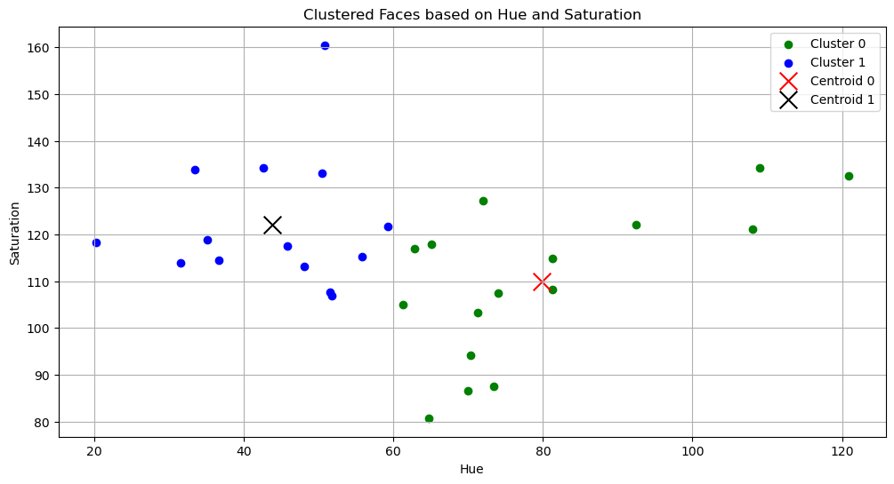
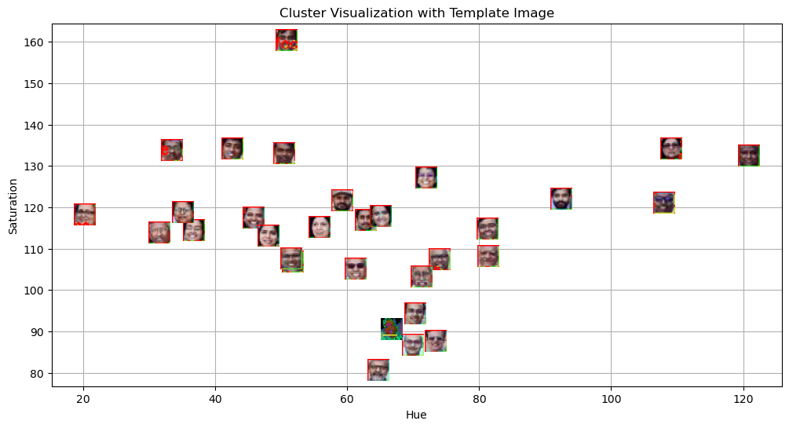

# Machine Learning Lab 5 – Face Clustering using K-Means

## Aim
The aim of this experiment was to perform clustering on face images using K-Means based on hue and saturation features extracted from images.

## Methodology
1. Face Detection:
- I used OpenCV’s cascade classifier to detect faces
  
2. Feature Extraction:
- I converted the images from BGR to HSV colour
- I extracted the features like hue and saturation values
- I calculated the mean hue and saturation for the detected face
  
3. Clustering:
- I applied K-Means clustering (k = 2) to each group
- I assigned each face to a cluster based on similarity
  
4. Hue and saturation were extracted
- The K-Means model predicted its cluster

5. Visualisation:
- I created a scatter plot of clusters
- centroids plotted
- template image plotted in predicted cluster

## Tools & Libraries
- Python
- OpenCV
- NumPy
- Matplotlib
- Scikit-learn

## Results
### Cluster Visualisation

This graph shows the clustering of detected faces based on their hue and saturation values. Each point on the graph represents a face from the dataset plotted using its mean hue and saturation. I applied K-Means clustering with two clusters, and the faces were grouped based on similarity in colour features.

The two different colours represent the two clusters formed by the algorithm. The centroids of both clusters are also plotted on the graph, which represent the centre of each cluster. From the visualisation, we can clearly see how the faces are separated into two groups based on their colour characteristics. This helps in understanding how K-Means clustering works on image features like hue and saturation.

### Template Prediction

This graph shows the clustered faces along with the template image based on hue and saturation values. K-Means was used to form two clusters and the centroids of both clusters are also plotted. The template image was processed separately and placed in its predicted cluster. From the graph, we can see that the template image lies close to one of the clusters, showing that it was correctly classified based on colour features.

## Key Findings
- I was able to successfully cluster the faces into two groups using hue and saturation features
- centroids clearly showed the centre of each cluster
- template image was correctly assigned to one of the clusters using the trained K-Means model
- visualising the clusters made it easier to understand how similar faces were grouped together

## Conclusion
I learned how feature extraction plays an important role in grouping similar data. By using simple colour features like hue and saturation, I was able to cluster and classify face images.
